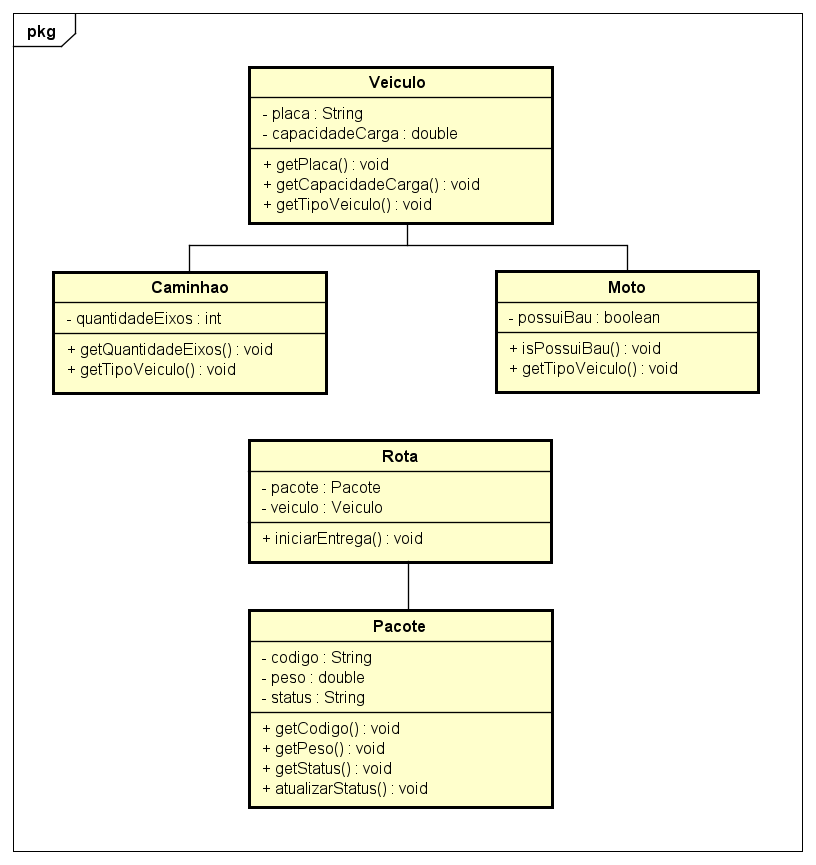

# FiapDelivery

Projeto desenvolvido para o **Check Point 2**, com foco na refatoração de um código legado utilizando conceitos de **Programação Orientada a Objetos (POO)** e **Clean Code**.

---

## Objetivo

Transformar um sistema com falhas estruturais em uma solução mais organizada, segura, reutilizável, escalável e de fácil manutenção.

---

## Problemas do Código Original

O sistema inicial apresentava diversos problemas, como:

- atributos públicos (falta de encapsulamento)
- nomes de variáveis sem significado
- duplicação de código entre classes
- associação limitada (Rota aceitava apenas caminhão)
- ausência de validações

---

## Solução Implementada

A refatoração trouxe melhorias importantes:

- uso de **encapsulamento** com atributos privados
- aplicação de **herança** com a classe abstrata `Veiculo`
- uso de **polimorfismo** para suportar diferentes veículos
- associação flexível entre `Rota`, `Pacote` e `Veiculo`
- validações para evitar dados inválidos
- padronização seguindo **Clean Code**

---

## Estrutura do Sistema

### > Veiculo (abstrata)
Classe base com:
- placa
- capacidade de carga

### > Caminhao
Herda de Veiculo e adiciona:
- quantidade de eixos

### > Moto
Herda de Veiculo e adiciona:
- presença de baú

### > Pacote
Representa o item transportado:
- código
- peso
- status (iniciado como "Pendente")

### > Rota
Responsável por:
- associar um pacote a um veículo
- iniciar a entrega
- atualizar o status do pacote

### > Principal
Classe responsável por executar o sistema.

---

## Conceitos de POO Aplicados

- **Encapsulamento** → proteção dos dados  
- **Herança** → reutilização de código  
- **Polimorfismo** → uso de diferentes veículos  
- **Associação** → relação entre objetos  
- **Construtores** → inicialização correta  

---

## Execução do Sistema

Exemplo de saída:

    Levando pacote BR999 no veículo ABC1234 (Caminhão)
    Status do pacote: Em transporte

Também é possível testar com moto alterando o tipo de veículo na classe principal.

---

## Estrutura do Projeto

    src/
     ├── br.com.fiapdelivery.model
     │   ├── Veiculo.java
     │   ├── Caminhao.java
     │   ├── Moto.java
     │   ├── Pacote.java
     │   └── Rota.java
     │
     └── br.com.fiapdelivery.main
         └── Principal.java

---

## Diagrama UML

O diagrama foi desenvolvido no Astah e representa:

- herança entre `Veiculo`, `Caminhao` e `Moto`
- associação entre `Rota`, `Pacote` e `Veiculo`

---

## Tecnologias Utilizadas

- Java  
- Programação Orientada a Objetos  
- Astah UML  
- GitHub  

---

## Aprendizados

- refatoração de código legado  
- aplicação prática de POO  
- organização e padronização de código  
- modelagem UML  

---

## Autora

**Giovanna Fernandes Pereira | RM:565434**

---

## Observação

O sistema permite facilmente a troca do tipo de veículo, demonstrando o uso de polimorfismo.

---

## Licença

Projeto acadêmico desenvolvido para a FIAP.
